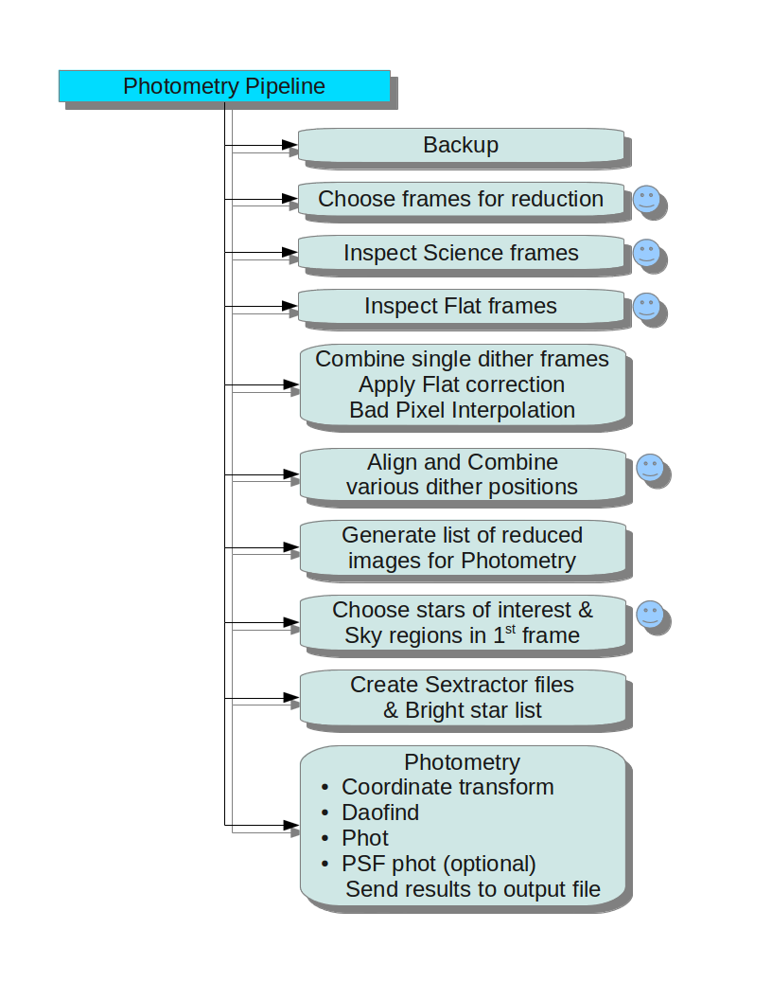
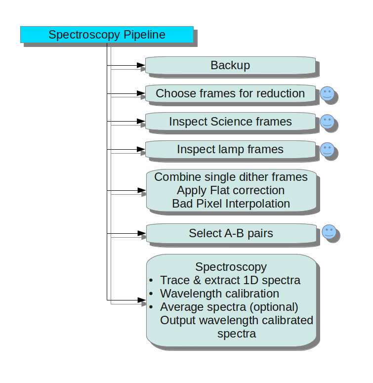

#Understanding various I/O files of the pipeline#

This page is to explain various input text files and output text files pipeline uses in each stage of the run. Learning this will give user power to tweak or edit the list of image files pipeline will use at each stage.

### TIRSPECscript.conf
This is the one and only configuration file of this pipeline. While running the TIRSPECdataReduction.py script, this file is to be given as the first argument. 

The settings of each variables available user can set in this file are as explained below.

Note: The format should be exactly  VARIABLE=<space>Value

* TODO= P   # P for Photometry and S for Spectroscopy
* OUTPUTDIR= MyFirstReduction   #Directory to which output files of this run has to be send.
* VERBOSE= yes     # Print as much information as possible while running
* TEXTEDITOR= "emacs -nw"  #Your favourite text editor. Other Egs: "vi"

* IMGCOMB= median  # Combining method while combining same dither position images
* DITHERCOMB= average   # Combining method while combining different dither position images
* SEPERATE_SKY= N #Give Y/N below if you need to subtract a seperate sky field. (Not needed if you are using that sky field as flat)

* BPMPHOTO= SlopeTIRSPECphoto-BP.pl   #Maskfile name for imaging images
* BPMSPEC= SlopeTIRSPECspec-BP.pl    #Maskfile name for spectroscopy images

* THRESHOLD= 5    #threshold for daofind
* EPADU= 1         # effective epadu gain for daophot
* READNOISE= 0.05   #effective readnoise of the image
* DATAMAX= 4000     #Saturation limit in image
* APPERTURE= 4*fwhm    #Aperture to be used for photometry (can be written as equation of variable 'fwhm')
* ANNULUS= 4*fwhm  #Sky annulus to be used for photometry (can be written as equation of variable 'fwhm')
* DANNULUS= 15 #Sky dannulas to be used for photometry (can be written as equation of variable 'fwhm')

* XYMATCHMIN= 4  # Minimum number of stars to match while xyxy matching photometric fields

* UT= TIME  #Header Key words for UT time in image header

* EXPTIME= ITIME  #Header Keywords. Not used now, but for future
* FILTER= LOWER   #Header Keywords. Not used now, but for future
* OBJECT= TARGET   #Header Keywords. Not used now, but for future
* COMMENT= TCOMMENT   #Header Keywords. Not used now, but for future

* OUTPUT= TIRSPECPhotometry_Output.txt  #Output file to write the selected magnitudes of the important sources. Note that all the .mag files of daophot will be there in each directory anyway.

* BACKUP= DataBackup  #Name of Directory to copy backup

* CONVOLVEIMG= NO  # To convolve images by gaussians set CONVOLVEIMG= [0.5,1.0,1.5,2.0,2.5,3.0] . Else to not do any convolving of images with gaussian set CONVOLVEIMG= NO

* DOPSF= NO # Set DOPSF= YES to do psf photometry, else put DOPSF= NO

Parameters related to Spectroscopy using iraf binaries
* ARGONDIRECTORY= LampRepo  #Directory containing already identified spectral lines of Argon for each band. This will be used to reidentify lines in spectrum.

* SPECAPPERTURE= 0.1   #The ratio of peak, which decides apperture to be used on the spectrum.
* BACKGROUND= -25:-15,15:25    #Iraf style background region to use to subtract background.
* TRACEFUNC= spline3    #Available trace functions in iraf's apall
* TRACEORDER= 1    # Order of trace function
* NORMFUNC= spline3  #Function to use for continuum fitting to normalise it
* NORMORDER= 3   # Order of the above function

* DISPAXIS= 2 # Disp axis is always =2 for TIRSPEC data

* SCOMBINE= YES  #Set YES if you want to average final spectra, otherwise NO.

### Input/Output files in each stage of pipeline
#### Photometry
Photometric pipeline stages are as shown in the figure below. 

**0: Backup ::** Copies everything in the present working directory to ../BACKUP

*Note: when ever I use upper case words like BACKUP, it refers to the variable set by that name in the TIRSPECscript.conf file 

**1: Choose frames for Reduction ::** Asks user for regular expression to choose frames of a particular object. Its related Flat, Sky, Argon etc.

Input files

* OUTPUTDIR/directories  (optional)# List of directories of night to run the pipeline in to reduce data in it.
* night/SlopeimagesLog.txt # The SlopeimagesLog.txt file which was generated at Hanle, and is present in every night directory of tirspec data

Output files

* OUTPUTDIR/night/AllObjects.List  # List of all object frames to reduce and their filters
* OUTPUTDIR/night/AllObjects-Flat.List  # List of all object frames and their corresponding flats
* OUTPUTDIR/night/AllObjects-Argon.List  # List of all object frames and their corresponding Argon
* OUTPUTDIR/night/AllObjects-Sky.List  # List of all object frames and their corresponding Sky

**2: Inspect Science frames ::** Displays objects frames one by one to accept or discard.

Input files

* OUTPUTDIR/directories   # Nights to run the pipeline
* OUTPUTDIR/night/AllObjects.List  # Created in previous step 1

Output files

* OUTPUTDIR/night/AllObjects2Combine.List # File containing list of selected frames separated by blank line to mark the sets of images of each dither to combine

**3: Inspect Flat frames ::** Displays Flat/Sky/Argon frames one by one to accept or discard.

Input files

* OUTPUTDIR/directories   # Nights to run the pipeline
* OUTPUTDIR/night/AllObjects-Flat.List  # Created in previous step 1
* OUTPUTDIR/night/AllObjects-Argon.List # Created in previous step 1
* OUTPUTDIR/night/AllObjects-Sky.List   # Created in previous step 1

Output files

* OUTPUTDIR/night/AllObjects-FinalFlat.List  # Selected Flat list
* OUTPUTDIR/night/AllObjects-FinalArgon.List # Selected Argon list
* OUTPUTDIR/night/AllObjects-FinalSky.List   # Selected Sky list

**4: Combine dither frames, Sky subtract , Flat correct, bp mask ::**  Combined images in each dither position by DITHERCOMB method. Then subtract Sky, Apply Flat fielding and also do badpixel mask interpolation.

Input files

* OUTPUTDIR/directories   # Nights to run the pipeline
* OUTPUTDIR/night/AllObjects.List   # Created in step 1
* OUTPUTDIR/night/AllObjects2Combine.List   # Created in step 2
* OUTPUTDIR/night/AllObjects-FinalFlat.List  # Created in step 3
* OUTPUTDIR/night/AllObjects-FinalSky.List   # Created in step 3
* OUTPUTDIR/night/AllObjects-FinalArgon.List # Created in step 3

Output files

* OUTPUTDIR/night/FirstoneANDcombinedImages.List  # List containing the first filename and the final combined image filename of this step (outputimage_FC.fits). A blank line separates the set of different dither position combined images.

outputimage=firstimage_DITHERCOMB_lastimage

* OUTPUTDIR/night/outputimage.flatlist  # List of images used for flat for this outputimage
* OUTPUTDIR/night/outputimage.skylist  # List of images used for sky for this outputimage
* OUTPUTDIR/night/outputimage_flat.fits  # Flat obtained for this outputimage
* OUTPUTDIR/night/outputimage_Nflat.fits  # Normalised flat used for this outputimage
* OUTPUTDIR/night/outputimage_sky.fits  # Sky obtained for this outputimage
* OUTPUTDIR/night/outputimage_SS.fits  # Sky subtracted stage of outputimage
* OUTPUTDIR/night/outputimage*_FC.fits  # Flat fielded stage of outputimage

**5: Align and Combine various dithers ::** Aligns and combines, already combined images of different dither positions
 
Input files

* OUTPUTDIR/directories   # Nights to run the pipeline
* OUTPUTDIR/night/AllObjects2Combine.List   # Created in step 2
* OUTPUTDIR/night/FirstoneANDcombinedImages.List  # Created in step 4

Output files

* OUTPUTDIR/night/FirstoneANDalignNcombinedImages.List  # First image and name of combined outputimage (outputimage.fits)

outputimage=firstimage_alignIMGCOMB_lastimage

* OUTPUTDIR/night/outputimage.GSCoo  # Good star coords used for aligning (imalign)
* OUTPUTDIR/night/outputimage.ditherList  # List of images in different dither positions used.
* OUTPUTDIR/night/outputimage.AlignedditherList  # List of aligned images from different dither positions.

**6: Create list of images for photometry ::** 

Input files

* OUTPUTDIR/directories   # Nights to run the pipeline
* OUTPUTDIR/night/AllObjects.List   # Created in step 1
* OUTPUTDIR/night/FirstoneANDcombinedImages.List  # Created in step 4
* OUTPUTDIR/night/FirstoneANDalignNcombinedImages.List  # Created in step 5

Output files

* OUTPUTDIR/Images4Photo.in  # List of all final reduced images.

**7: Choose Star, Sky region ::** Askes user to select good stars, and good sky regions in first image.

Input files

* OUTPUTDIR/Images4Photo.in  # Created in step 6

Output files

* OUTPUTDIR/Sources.coo  # Coordinate of source of primary interest
* OUTPUTDIR/GoodStars.coo  # Coordinate of Good stars for PSF measurements
* OUTPUTDIR/BlankSky.coo  # Coordinate of Blank sky regions
* OUTPUTDIR/qphotinput.txt  # Coordinate and parameters for qphot photometry

**8: Create Sextractor files and Bright star list ::**

Input files

* OUTPUTDIR/Images4Photo.in  # Created in step 6

Output files

* OUTPUTDIR/FirstImageTop30.coo  # List of first 30 bright stars in the field
* OUTPUTDIR/test.cat  # Raw sextractor output catalogue
* OUTPUTDIR/sextractor.sex  # New Sextractor config files, only if not already present.
* OUTPUTDIR/default.conv  # New Sextractor config files, only if not already present.
* OUTPUTDIR/default.param  # New Sextractor config files, only if not already present.

**9: Photometry ::**

Input files

* OUTPUTDIR/Images4Photo.in  # Created in step 6
* OUTPUTDIR/FirstImageTop30.coo  # Created in step 8
* OUTPUTDIR/sextractor.sex  # Created in step 8
* OUTPUTDIR/default.conv  # Created in step 8
* OUTPUTDIR/default.param  # Created in step 8
* OUTPUTDIR/Sources.coo  # Created in step 7
* OUTPUTDIR/GoodStars.coo  # Created in step 7
* OUTPUTDIR/BlankSky.coo  # Created in step 7
* OUTPUTDIR/qphotinput.txt  # Created in step 7

Output files

* OUTPUTDIR/night/image+xymatch.out  # Output of xyxymatch iraf task
* OUTPUTDIR/night/image+Source.coo  # geoxytran transformed coordinates
* OUTPUTDIR/night/image+GoodStars.coo  # geoxytran transformed coordinates
* OUTPUTDIR/night/image+BlankSky.coo  # geoxytran transformed coordinates
* OUTPUTDIR/night/image+qphotinput.txt  # geoxytran transformed coordinates
* OUTPUTDIR/night/image+.mag*  # standard daophot .mag files , .als files etc
* OUTPUTDIR/OUTPUT # Output file containing the selected magnitudes of the important sources in Source.coo, GoodStars.coo and qphotinput.txt

#### Spectroscopy
Spectroscopy pipeline stages are as shown in the figure below. 

Stages 0,1,2,3 and 4 are exactly same as already explained in the Photometry pipeline above. The steps differ only after these initial steps are over.

